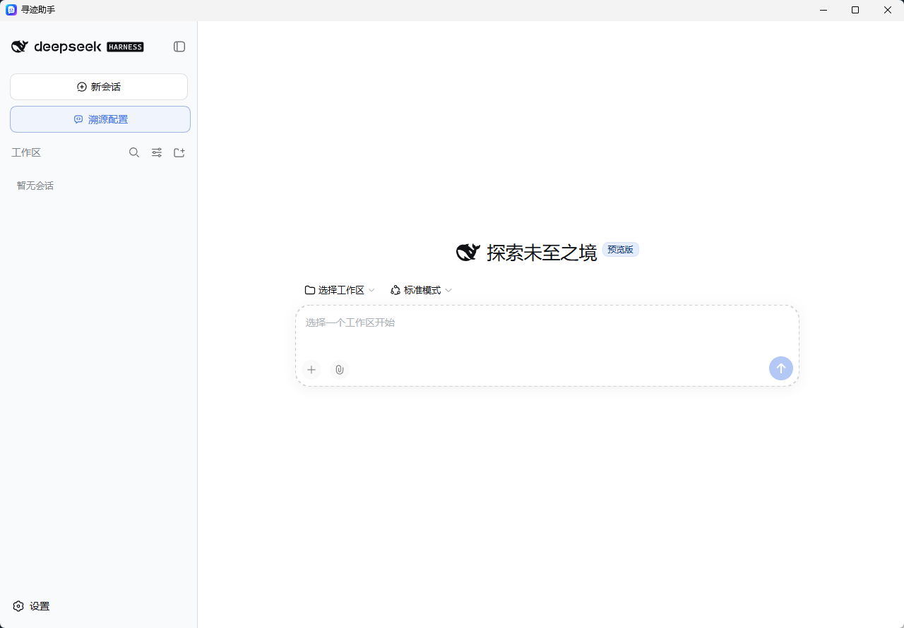
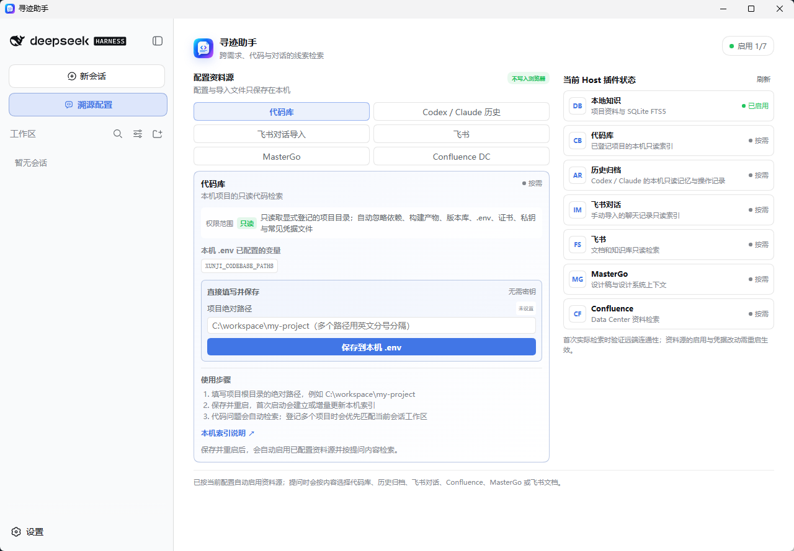

# 寻迹助手

装在本机的桌面助手。用自然语言提问，它会按问题内容自动去查你登记的代码库、导入的飞书聊天记录、Confluence 规范、MasterGo 设计稿和你过往与 Codex / Claude 的会话，每条回答末尾都标明这次实际查了哪些来源、依据是什么。

基于 [DeepSeek Harness](https://github.com/deepseek-ai/deepseek-harness)（DSH）构建，不修改其核心。所有资料源只读，资料留在本机。



## 它能查什么

- **代码库**：登记本机项目根目录，建立增量只读索引，问接口、路由、组件在哪个文件。
- **飞书聊天记录**：把飞书导出的聊天文档拖进来即可检索"谁在什么时候说了什么"，不连接飞书账号。
- **Codex / Claude 历史**：索引本机的 AI 会话记录和项目记忆，找回之前讨论过的方案和结论。
- **Confluence、飞书文档、MasterGo**：填入凭据后按需启用，全部走只读接口；第三方 MCP 经本机只读代理启动，写操作对模型不可见。
- **回答可追溯**：每条回答尾部有"实际检索"和"依据"，没查到依据时会明说，不编造。



## 安装使用

1. 从 Releases 下载 `xunji-<版本>-setup.exe`，双击安装，不需要管理员权限，也不需要预装 Node。
2. 首次启动会初始化约一分钟，之后秒开。
3. 在设置的"模型"里填入 DeepSeek API 密钥，Agent 预设选"标准模式"。
4. 点左侧栏"溯源配置"，登记代码库路径、上传飞书导出文件或填入其他资料源的凭据。

完整步骤、常见问题见 [使用说明](docs/使用说明.md)。目前仅支持 Windows 10 / 11。

## 隐私

资料、索引、凭据都在 `%LOCALAPPDATA%\寻迹助手` 下；离开本机的只有你的提问和检索命中的片段，发往你选定的模型服务。想改用内网模型，在 DSH 设置里添加 OpenAI 兼容的提供方即可。哪些会发、哪些不会，见 [隐私说明](docs/隐私说明.md)。

## 从源码运行

要求 Node.js 22.19 以上。

```powershell
npx -y pnpm@11.21.0 install
npm run doctor
npm run setup
npm start
```

打包安装版需要 Rust 与 Inno Setup：

```powershell
npm run package
npm run package:installer
```

各资料源的配置方式、接入新资料源的步骤、打包与升级细节见 [开发指南](docs/开发指南.md)，设计边界见 [架构说明](docs/architecture.md)。

## 目录结构

| 目录 | 内容 |
|---|---|
| `profiles/` | DSH 配置层：默认 Profile 与各资料源的 MCP 接入定义 |
| `plugins/xunji-workbench/` | 工作台插件：资料路由提示词、配置页、来源标注 |
| `scripts/` | 启动、配置服务、本机检索 MCP 及其协议骨架、只读代理、打包 |
| `shell/` | Tauri 桌面外壳 |
| `docs/` | 使用说明、隐私说明、开发指南 |

## 参与开发

分支约定、本地验证和提 PR 的方式见 [CONTRIBUTING.md](CONTRIBUTING.md)。

## 许可证

[MIT](LICENSE)
